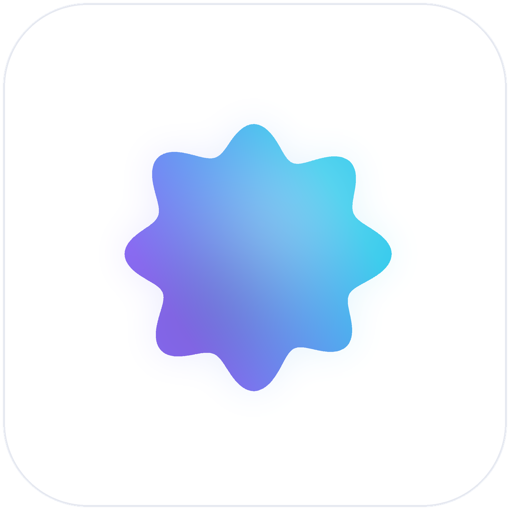

<p align="center">
  
</p>

# SmolLLM Studio

**Run small local LLMs beautifully on macOS and Windows.**

SmolLLM Studio is a lightweight Rust/Tauri desktop app for running small local
language models. It focuses on 0.5B–4B GGUF models, automatic hardware
recommendations, one-click downloads, a chat UI that streams tokens, and an
OpenAI-compatible server on loopback — all on your own machine.

There is no account, no API key and no telemetry. The only network traffic the
app ever makes is the model download you explicitly ask for. There is no
update pinger, no analytics, and no background request of any kind — the HTTP
server you start stays on `127.0.0.1`. [docs/privacy.md](docs/privacy.md) lists
every request and every file, so you can check that sentence.

> No screenshots are committed yet, so this README has no pictures of the app.
> [assets/screenshots/README.md](assets/screenshots/README.md) names the five
> captures that belong here, the exact state each one should show, and how to
> take them.

---

## Please read this first: what is real, and what is a seam

SmolLLM Studio is honest about itself, and so is this README.

**Working today**

- The curated catalog, hardware detection, the doctor report and the
  RAM-fit maths that drives every recommendation.
- Resumable downloads from Hugging Face: `.part` files with provenance-checked
  resume, SHA-256 and GGUF-header verification, bounded auto-retry on flaky
  networks, cancel and retry buttons, and a live transfer list.
- GGUF metadata parsing straight from the file header (architecture,
  quantisation, context length, tensor count, license) and a memory figure
  measured from that header: the bytes the tensor section really holds, plus a
  KV cache sized by the model's own attention geometry.
- Integrity checks for files already in the library: header, tensor data bounds,
  weight bytes per parameter and the size the catalog publishes, per file or for
  the whole folder. GGUF stores no checksum, so a check says `skipped` rather
  than pretending to have proved something it could not measure.
- A model folder that can be moved to another disk with its files: rename when
  both folders share a volume, a proved copy when they do not, and a report of
  what moved and what was left alone. A name the destination already holds is
  never overwritten, and the old folder is never deleted.
- The whole UI: eight pages, streaming chat with sampling controls — seed and the
  stop sequences an answer is cut at included — server page with copyable client
  snippets, benchmarks, log viewer, settings.
- Conversations kept on disk as one JSON file per chat — list, search across
  titles and answers, rename, export to Markdown or JSON, reopen on launch. An
  answer is written when it finishes, so quitting never loses one.
- An OpenAI-compatible HTTP server (`/health`, `/v1/models`, `/v1/models/{id}`,
  `/v1/chat/completions`, `/v1/completions`, `/v1/engine/metrics`) with
  `stream: true` over SSE and `stream_options.include_usage`.
- A command-line twin (`smollm`) that shares every crate with the desktop app.

**Inference: real, but opt-in**

Building with `--features llama-cpp` links llama.cpp (the `llama-cpp-2` bindings
vendor and compile it, so this needs cmake and a C/C++ toolchain) and you get
genuine generation: the model's own tokenizer and chat template, tokens streamed
from a dedicated decode thread, stop sequences and cancellation honoured per
token, and metrics naming the device that actually ran — Metal on Apple Silicon,
CUDA or Vulkan where llama.cpp found one. Whether offloading happens at all is
asked of llama.cpp rather than assumed from the settings, and the decode thread
count you set is applied — lowered to the cores this machine runs at once, with a
warning naming both numbers, when it asks for more than the host has.

**Not wired up yet**

- **The default build still simulates.** Without that feature the app ships
  `MockEngine`, which produces token-by-token output that *looks* like
  generation so the entire streaming, cancellation and metrics path can be
  exercised end to end on any machine. It does not read weights, and what it
  says is not the model's answer. Every screen that can show it labels it
  **simulated**, and the engine is only chosen if this build can actually run
  it — Mock answers rather than the app failing to start. That is deliberate.
- **`candle` is an adapter without a runner.** The feature compiles the seam and
  clearly reports that it cannot serve a request, so it never displaces Mock.
- **The coding agent is mid-build.** A second binary, `smoll`, exists in
  `crates/agent-cli` and currently resolves and prints its configuration
  (`smoll init`, `smoll config`); `doctor`, `tools` and `task` answer that they
  are not wired yet, and there is no `chat`. The loop itself is built and tested:
  it gathers repository context, proposes a plan, asks a provider for tool calls,
  gates every call through the sandbox policy, repairs a truncated answer once,
  proposes a diff in `suggest-only`, writes with approval, runs the project's own
  validation command and can undo what it wrote — driven end to end in
  [crates/agent-core/tests/loop_runs.rs](crates/agent-core/tests/loop_runs.rs)
  against the scripted mock. That mock is the only provider that answers today,
  alongside the echo inspector, which reports what a prompt costs: the GGUF and
  OpenAI-compatible adapters return an error naming the missing piece rather
  than falling back to the mock.

We deliberately did not rewrite llama.cpp. The engine is an abstraction
(`Engine` + `EngineManager`) with one integration point per backend, so each
library is a contained change:
[crates/smollm-engine/src/llama.rs](crates/smollm-engine/src/llama.rs).

---

## Why SmolLLM Studio

- **Small models only.** 0.5B–4B at Q4 is the sweet spot for a laptop: seconds
  to load, usable speed, no discrete GPU required. The catalog is curated for
  that band instead of pretending your MacBook Pro runs Llama 70B.
- **It measures your machine first.** `sysinfo` reads RAM, cores and GPU at
  launch; the doctor tells you the largest band that will actually fit, and
  every model card says whether it fits *right now*.
- **Local by default, provably.** Loopback-only server, plain JSON settings on
  disk, one data folder you can open from the app, and a diagnostics export for
  bug reports. The one secret the app can hold — a Hugging Face token — goes to
  the OS credential store instead of `settings.json`, is only ever printed with
  its middle hidden, and is sent to no host but the one it was written for.
- **Two surfaces, one core.** The desktop app and the CLI are both thin shells
  over the same five crates. Anything you can do in the UI you can script.
- **Premium, not heavy.** Rust and Tauri: no bundled Chromium, no Python
  runtime, no Node sidecar.

## Supported platforms

| Platform | Status | Notes |
| --- | --- | --- |
| macOS 12+ (Apple Silicon) | Supported | Primary development target |
| macOS 12+ (Intel) | Supported | CPU inference only |
| Windows 10 / 11 (x64) | Supported | WebView2 is required (present on Windows 11) |
| Linux | Builds and runs | Not a packaging target; use the CLI |

## Quickstart

1. Download the latest release:
   - macOS: `SmolLLM_0.1.0_aarch64.dmg`
   - Windows: `SmolLLM_0.1.0_x64-setup.exe` (or the `.msi`)
2. Open it. The first launch answers three questions before anything else: what
   stays on this machine, what this machine can actually run, and which small
   model to fetch first. Close it as soon as you have read it — that counts as
   finishing. Afterwards the app just detects your hardware and shows what fits.
3. On the **Models** page, press **Download** on something small — Qwen2.5 0.5B
   or SmolLM2 360M are good first runs.
4. Press **Load**, then **Chat**.
5. Come back later: the app reopens your last conversation, and the
   **Conversations** panel lists every chat that has an answer in it — click to
   reopen, search across titles and text, rename, or export as Markdown or JSON.

The first load is a cold read from disk, so it is slower than the numbers you
see afterwards. If the app was installed from a plain release build, that
conversation is simulated — read "Inference: real, but opt-in" above before you
trust an answer.

Prefer the terminal?

```bash
smollm doctor                       # what can this machine run?
smollm models list --sort smallest  # browse the catalog
smollm models pull qwen2.5-0.5b-instruct-gguf
smollm models import ~/Downloads/MyModel-Q4_K_M.gguf   # a file you already have
smollm models verify                # is every file in the library still whole?
smollm models move /Volumes/fast/Models   # put the library somewhere else, files and all
smollm auth status                # which Hugging Face token would be sent, middle hidden
smollm run qwen2.5-0.5b-instruct-gguf --prompt "Explain GGUF in two sentences"
smollm run SmolLM2-360M-Instruct-Q4_K_M.gguf --seed 123 --stop "###" --threads 4   # same answer every time
smollm serve --port 8123            # OpenAI-compatible API on loopback
```

If you would rather have that `smollm` on your PATH than run it out of
`target/`, the install scripts build from this checkout and drop the binary in
your user bin directory — no sudo, no download:

```bash
./scripts/install.sh                  # macOS / Linux -> ~/.local/bin/smollm
powershell -File scripts/install.ps1  # Windows -> %LOCALAPPDATA%\Programs\smollm
```

## Development setup

You need Rust 1.77+, Node 20+ with corepack, and pnpm 9.

```bash
git clone https://github.com/antontuzov/smollm-studio
cd smollm-studio

# 1. Rust workspace: engine, catalog, downloader, server, CLI
cargo build --workspace

# 2. Frontend + desktop shell
cd desktop
corepack enable
pnpm install
pnpm tauri dev    # starts Vite on :1420 and the native window
```

`pnpm dev` alone gives you the UI in a browser with every command failing into
its error state — handy for styling, useless for data.

To run real weights, ask for the native engine. It compiles llama.cpp from the
sources the `llama-cpp-2` bindings vendor, so cmake and a C/C++ toolchain have to
be there:

```bash
cargo build -p smollm-cli --features llama-cpp
cd desktop && pnpm tauri dev --features llama-cpp

smollm hardware            # the "Offload" line names llama.cpp's own device
```

Without that feature every engine call lands on MockEngine, and the app labels
its numbers simulated.

Release bundles:

```bash
cd desktop && pnpm tauri build
```

Checks, all of which CI enforces:

```bash
cargo fmt --all -- --check
cargo clippy --workspace --all-targets --all-features -- -D warnings
cargo test --all
cd desktop && pnpm typecheck && pnpm lint && pnpm build
```

Bundling needs the Tauri system prerequisites for your OS, described at
<https://tauri.app/start/prerequisites/>.

## Model support

The bundled catalog holds 13 entries, from 0.36B to 4B parameters, all Q4-class
quantisations, and all `verified` — meaning the Hugging Face repository, file
name and GGUF architecture were confirmed against the resolver and the file's own
header. Entries you add through `catalog.local.json` are marked `placeholder`
until verified.

| Model | Params | Download | Context | Notes |
| --- | --- | --- | --- | --- |
| SmolLM2 360M Instruct | 0.36B | 271 MB | 8K | Fastest thing worth chatting with |
| Qwen2.5 0.5B Instruct | 0.5B | 491 MB | 32K | Best tiny all-rounder |
| Gemma 3 1B IT (QAT) | 1.0B | 720 MB | 8K | Quantisation-aware training |
| Llama 3.2 1B Instruct | 1.24B | 808 MB | 131K | Long context in a small package |
| Qwen2.5 1.5B Instruct | 1.54B | 1.1 GB | 32K | Noticeably better reasoning |
| DeepSeek R1 Distill Qwen 1.5B | 1.54B | 1.1 GB | 8K | Emits a reasoning trace before answering |
| SmolLM2 1.7B Instruct | 1.71B | 1.1 GB | 8K | Balanced Hugging Face model |
| MiniCPM5 2B | 2.52B | 1.6 GB | 8K | Llama-shaped, 2 KV heads, cheap long context |
| Granite 3.1 2B Instruct | 2.53B | 1.5 GB | 8K | IBM's Harmony-style template |
| Qwen2.5 3B Instruct | 3.1B | 2.1 GB | 32K | Approaches useful coding help |
| Llama 3.2 3B Instruct | 3.2B | 2.0 GB | 131K | Strong instruction following |
| Phi-3 Mini 4K Instruct | 3.8B | 2.4 GB | 4K | Dense reasoning for its size |
| Gemma 3 4B IT (QAT) | 4.0B | 2.5 GB | 8K | The ceiling this app recommends |

The Models page filters this list by parameter band, quantisation, tag, license,
architecture and whether the file is already in your library. Every dropdown is
built from the catalog itself, so an overlay entry contributes its own tags and
licenses too.

Any other GGUF file works too: drop it into the model folder (Settings shows the
path, with a **Model folder** button) and it appears in the Library, parsed from
its own header. Out of room on the boot volume? **Settings → Models and engine →
Move** takes the library to another disk with it — renamed when it can be, proved
by header when it has to be copied, and never overwriting a file it finds there.
Model licenses differ — check the card if you plan to ship something.

A handful of repositories are gated: Llama's own, and some of Google's, answer
`401` until you have accepted their licence and are signed in. **Settings →
Hugging Face access** holds a fine-grained token for those, kept in the macOS
Keychain or the Windows Credential Manager rather than in a settings file, shown
only by its ends, and attached to no request but one aimed at `huggingface.co` —
the CDN a download redirects to is served without it. `smollm auth set` writes the
same entry from a terminal. Every other catalog entry needs no credential at all.

## Hardware recommendations

The app computes this per machine; the table is the rule of thumb behind it.
Weights are estimated as `file size + KV cache + ~350 MB of runtime`, and only
70% of currently free RAM counts as usable.

| RAM | Comfortable band | Expect |
| --- | --- | --- |
| 4 GB | 0.36B–0.5B | Close other apps; short contexts |
| 8 GB | up to 1.5B | The intended experience for most people |
| 16 GB | up to 3B–4B | Room for longer prompts and a second app |
| 32 GB+ | 4B and beyond | This app still caps its advice at 4B on purpose |

Disk: 5 GB free holds a normal working set of three or four models; downloading
all 13 catalog entries is about 18 GB. GPU: not required. Apple Silicon and CUDA
help when the app is built with `--features llama-cpp` — llama.cpp then offloads
layers and the app reports the device it got; the mock engine runs on CPU
everywhere. Details in [docs/hardware.md](docs/hardware.md).

## OpenAI-compatible API

Start it from the **Server** page or with `smollm serve --port 8123`, then point
any OpenAI client at `http://127.0.0.1:8123/v1`.

```bash
curl http://127.0.0.1:8123/v1/chat/completions \
  -H "Content-Type: application/json" \
  -d '{
    "model": "qwen2.5-0.5b-instruct-gguf",
    "messages": [{"role": "user", "content": "One line about local models."}],
    "stream": true
  }'
```

```python
from openai import OpenAI

client = OpenAI(base_url="http://127.0.0.1:8123/v1", api_key="unused")

stream = client.chat.completions.create(
    model="qwen2.5-0.5b-instruct-gguf",
    messages=[{"role": "user", "content": "One line about local models."}],
    stream=True,
)
for chunk in stream:
    print(chunk.choices[0].delta.content or "", end="", flush=True)
```

No key is checked, which is safe only because the server refuses to bind to
anything but loopback — [SECURITY.md](SECURITY.md) says what that does not cover
before you point another program at that port on a shared machine. The Server
page generates both snippets with your actual port and model filled in. Full
reference: [docs/api.md](docs/api.md).

## Security and privacy

Three files state what the code does rather than what a product page would
prefer:

- [SECURITY.md](SECURITY.md) — what is protected (loopback-only bind, keychain
  storage for a Hugging Face token, the webview's Content-Security-Policy,
  download validation) and, in as much space, what is not: an unauthenticated
  local API, untrusted model output, plaintext transcripts, unsigned releases.
- [docs/privacy.md](docs/privacy.md) — the no-telemetry claim with the evidence:
  the only two requests the app ever makes, what the registry sees when you make
  one, every file it writes and where, and how to remove all of it.
- [NOTICE](NOTICE) — llama.cpp and the bindings that build it, Inter's font
  licence, the pinned dependency tree, and the licences model weights travel
  under.

Report a vulnerability as a private GitHub advisory rather than a public issue;
where to send it and what to include is in `SECURITY.md`.

## How it is laid out

```
crates/
  smollm-core       domain types, errors, config, paths, GGUF metadata, sessions
  smollm-engine     InferenceEngine trait, llama.cpp and Mock engines, GGUF
                    reader, benchmark, device probe
  smollm-models     catalog, Hugging Face resolver, resumable downloads, library
  smollm-hardware   sysinfo detection, GPU probing, the doctor
  smollm-server     Axum OpenAI-compatible API
  smollm-cli        the `smollm` binary
  agent-config      the TOML the agent runs on, plus env and CLI overrides
  agent-sandbox     policy, approval modes, audit log and secret redaction
  agent-tools       the nine tools, their registry, the gate and rollback journal
  agent-repo        ignore-aware index, repo map, search ranking and unified diffs
  agent-providers   Provider trait, tool-call parsing, Mock and Echo providers
  agent-core        the loop: context, plan, tools, repair, approval, validation
  agent-cli         the `smoll` binary
desktop/
  src/              React + TypeScript UI (8 pages)
  src-tauri/        41 commands, event bridge, tray, bundling
```

The `agent-*` crates are the coding agent being built on top of the model layer,
and the desktop app is frozen while that happens: it keeps passing its gates and
gets no new features. Configuration is documented in
[docs/agent-config.md](docs/agent-config.md), the provider layer in
[docs/providers.md](docs/providers.md).

## Roadmap

In order, and none of it promised:

1. Token-by-token context pressure warnings, and KV-cache quantisation.
2. A GGUF conversion helper, for a safetensors you want quantised rather than a
   file you can already import.
3. Auto-update via the Tauri updater plugin, replacing today's "a newer release
   exists" notice.
4. More catalog coverage: multilingual, code-tuned and vision-capable small
   models, each verified the same way.
5. Signed, notarised macOS and Windows bundles built with `llama-cpp`, so the
   real engine reaches an install rather than a source build.

## License

MIT — see [LICENSE](LICENSE). Your models stay yours; their licenses travel
with them, and [NOTICE](NOTICE) lists the parts of this app that are not ours:
llama.cpp behind a feature flag, the Inter font files under the SIL Open Font
Licence, and the pinned dependency tree.

## Contributing

Issues and pull requests are welcome, especially for item 1 above. Start with
[CONTRIBUTING.md](CONTRIBUTING.md);
[docs/getting-started.md](docs/getting-started.md) covers the first build.

## Credits

- [llama.cpp](https://github.com/ggml-org/llama.cpp) and the
  [GGUF format](https://huggingface.co/docs/hub/gguf) — the reason small models
  run on laptops at all. This repository contains no llama.cpp source; the
  `llama-cpp` feature pulls it in through the bindings at build time.
- [Hugging Face](https://huggingface.co) — hosts every model file this app can
  download, and publishes SmolLM2, Qwen, Llama, Gemma, Phi and DeepSeek
  distills.
- The [Tauri](https://tauri.app), [Axum](https://docs.rs/axum),
  [Tokio](https://tokio.rs), [React](https://react.dev) and
  [TanStack Query](https://tanstack.com/query) projects.
